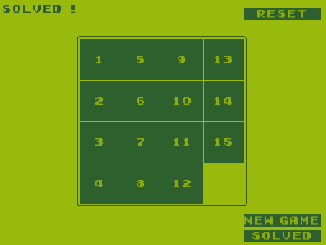

# LÖVE Slide Puzzle
A slide puzzle is a combination puzzle that challenges a player to slide pieces along certain routes to establish a certain end-configuration. It based on this [pygame example](https://inventwithpython.com/pygame/chapter4.html).
## Screenshots

## Addons
* [Love2D](https://love2d.org) - website of LÖVE.
* [Font](https://www.dafont.com/early-gameboy.font) - dafont website
* [Biopushy module](https://github.com/a327ex/boipushy) - github page
* [Timer module](https://github.com/vrld/hump) - github page
* [Gameplay](https://youtu.be/Oj8zQ21XP58) - youtube
